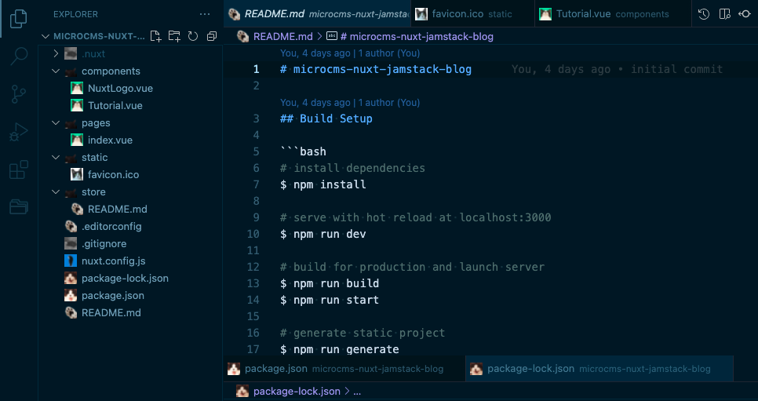

# otanyan-icons README

## Example


## Installation

To install the extension just execute the following command:

```sh
ext install otanyan-icons
```

## Usage
* `Linux` & `Windows` > **File > Preferences > File Icon Theme > Otanyan Icons**.
* `MacOS` > **Code > Preferences > File Icon Theme > Otanyan Icons**.

### For more information

* [Visual Studio Code's Markdown Support](http://code.visualstudio.com/docs/languages/markdown)
* [Markdown Syntax Reference](https://help.github.com/articles/markdown-basics/)

**Enjoy!**
